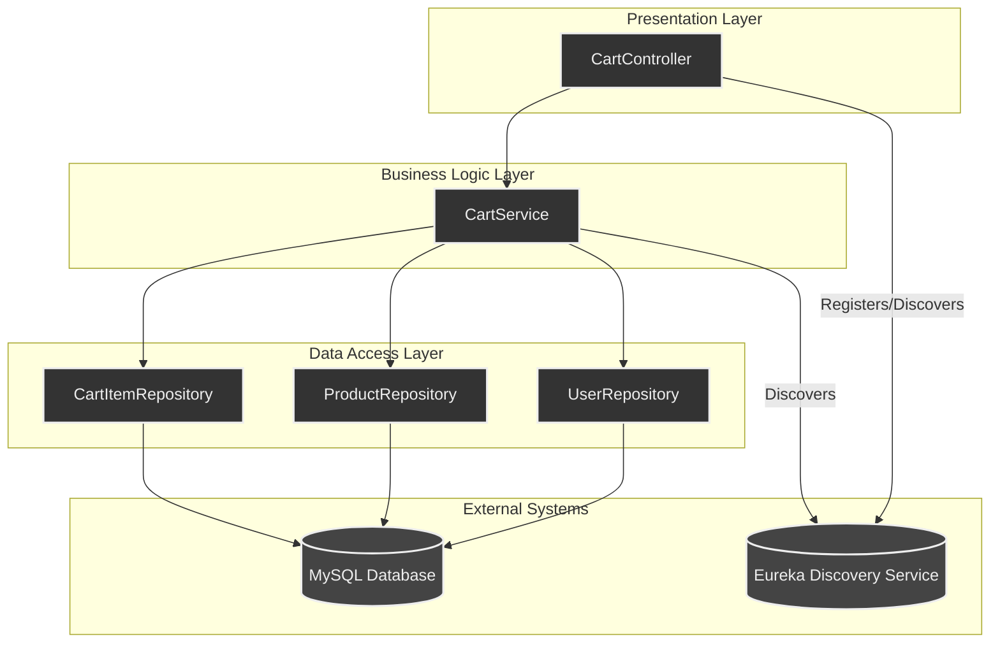
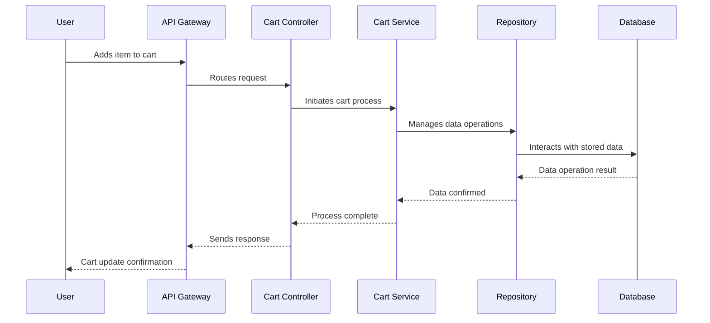

# E-Commerce Website
## Overview
The **Shopping Cart Module** is a key component of the E-Commerce application that provides functionality for managing a user's shopping cart. It allows users to:

- Add products to their cart.
- View the items in their cart.
- Remove items from their cart.
- Calculate the total price of items in their cart.

This module interacts with the `Product` and `User` modules to fetch product details and associate cart items with users. It is built using **Spring Boot**, **Spring Data JPA**, and an **H2 in-memory database** for development and testing. The module also integrates with **Spring Cloud Netflix Eureka** for service discovery and **Springdoc OpenAPI** for API documentation.

## Architecture

# E-commerce Application Architecture Diagrams

This document outlines the architectural components, class relationships, and key interaction flows for the shopping cart module of our Spring Boot-based e-commerce application.

---

## 1. Component Diagram

This diagram illustrates the high-level relationships and interactions between the main components of the application.


## 2. Flow Diagram


The Shopping Cart Module follows a **layered architecture** to ensure separation of concerns and maintainability:

1. **Controller Layer**:
   - Handles HTTP requests and responses.
   - Contains REST endpoints for cart operations such as adding items, viewing the cart, and removing items.

2. **Service Layer**:
   - Contains the business logic for managing the shopping cart.
   - Handles operations like adding products to the cart, calculating total prices, and interacting with repositories.

3. **Repository Layer**:
   - Interacts with the database using Spring Data JPA.
   - Manages CRUD operations for entities like `CartItem`, `Product`, and `User`.

4. **Model Layer**:
   - Defines the entities (`CartItem`, `Product`, `User`) and their relationships.
   - Represents the database tables and their mappings.

### High-Level Architecture Diagram


## Controller Endpoints and Their Functions

### 1. **Add to Cart**
- **Endpoint**: `/api/cart/add`
- **Method**: `POST`
- **Function**: Adds a product to the user's cart. If the product already exists in the cart, it updates the quantity and total price.

### 2. **Remove from Cart**
- **Endpoint**: `/api/cart/remove/{cartItemId}`
- **Method**: `DELETE`
- **Function**: Removes a specific item from the user's cart based on the cart item ID.

### 3. **View Cart**
- **Endpoint**: `/api/cart/view/{userId}`
- **Method**: `GET`
- **Function**: Retrieves all items in the cart for a specific user.

### 4. **Get Total Price**
- **Endpoint**: `/api/cart/total/{userId}`
- **Method**: `GET`
- **Function**: Calculates and returns the total price of all items in the user's cart.

### 5. **Get All Products**
- **Endpoint**: `/api/cart/products`
- **Method**: `GET`
- **Function**: Retrieves a list of all available products in the system.


## Tables
### Product Table

| Column Name   | Data Type | Description           |
|---------------|-----------|-----------------------|
| `product_id`  | BIGINT    | Primary key           |
| `name`        | VARCHAR   | Name of the product   |
| `price`       | DOUBLE    | Price of the product  |

### App_User Table

| Column Name   | Data Type | Description       |
|---------------|-----------|-------------------|
| `user_id`     | BIGINT    | Primary key       |
| `name`        | VARCHAR   | Name of the user  |

### Cart_Item Table

| Column Name     | Data Type | Description                     |
|------------------|-----------|---------------------------------|
| `cart_item_id`   | BIGINT    | Primary key                     |
| `product_id`     | BIGINT    | Foreign key referencing `product` |
| `user_id`        | BIGINT    | Foreign key referencing `app_user` |
| `quantity`       | INT       | Quantity of the product in cart |
| `total_price`    | DOUBLE    | Total price for the cart item   |


## File Structure
```
E_Commerce/                   # E-Commerce Spring Boot application
├── src/
│   ├── main/
│   │   ├── java/com/platform/ecommerce/
│   │   │   ├── EcommerceApplication.java  # Main application class
│   │   │   ├── config/                    # Configuration classes
│   │   │   │   └── DataSeeder.java        # Seeds initial data
│   │   │   ├── controller/               # API endpoints
│   │   │   │   └── CartController.java    # Handles cart-related endpoints
│   │   │   ├── model/                    # JPA entities
│   │   │   │   ├── CartItem.java         # Cart item entity
│   │   │   │   ├── Product.java          # Product entity
│   │   │   │   └── User.java             # User entity
│   │   │   ├── repository/               # Data access layer
│   │   │   │   ├── CartItemRepository.java # Cart item repository
│   │   │   │   ├── ProductRepository.java  # Product repository
│   │   │   │   └── UserRepository.java     # User repository
│   │   │   ├── service/                  # Business logic
│   │   │   │   └── CartService.java      # Handles cart operations
│   │   └── resources/
│   │       ├── application.properties    # Application configuration
│   │       └── static/                   # Static resources (if any)
├── test/                                 # Unit tests
│   ├── java/com/platform/ecommerce/
│   │   └── EcommerceApplicationTests.java # Unit tests for the application
├── pom.xml                               # Maven configuration file
```
